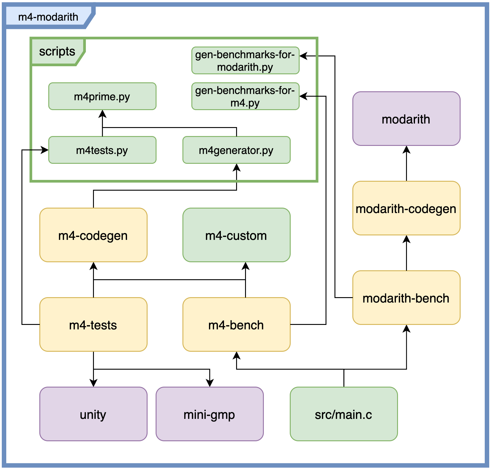

# Project Structure

## Structure of the library

Our library is focused on our main script, the `m4generator.py`. However, several other elements are also part of it. In the figure below, we provide an overview of the structure of our library. The prime data logic is implemented in class `Prime`, contained in `m4prime.py`, which is used for both the main generator and our tests generator (`m4tests.py`).

Green elements are folders containing original code from the library, yellow are folders containing code automatically generated by the scripts, while purple ones are external libraries. Arrows indicate a dependency of the "uses" type.

The `modarith-codegen` folder is generated using the `modarith` scripts with a 32-bit word length and selected primes, namely the pseudo-Mersenne primes $2^{255}-19$ (C25519), $2^{266}-3$ (PM266), $2^{512}-569$ (PM512), and $2^{521}-1$ (NIST521), the Solinas primes used for C448 ($2^{448} - 2^{224} - 1$) and NIST256 ($2^{256} - 2^{224} + 2^{192} + 2^{96} - 1$), and the Montgomery-friendly primes used for isogeny-based applications such as SQIsign named MFP248, MFP376 and MFP500.

For the `m4-codegen` folder, M4-specific code for the same primes is generated, but using the `m4generator.py` script. 

Tests are generated in the `m4-tests` folder, while benchmarks are generated for both libraries in the `m4-bench` and `modarith-bench` folders, for `m4-modarith` and `modarith`, respectively.